## Welcome to my github profil
(https://github.com/Abdurahmanm2020)

here you can see all of my great and hard werk in one

### profil

 1. [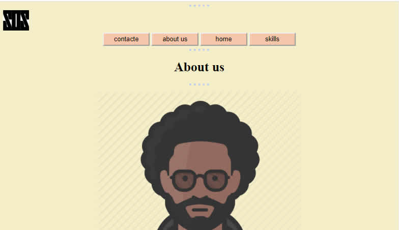](https://abdurahmanm2020.github.io/sos-two/index.html) this is the first web I have ever made
 
 2. [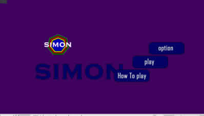](https://abdurahmanm2020.github.io/SIMON/start.html) this is a game called simon a very full a brane using game

 3. [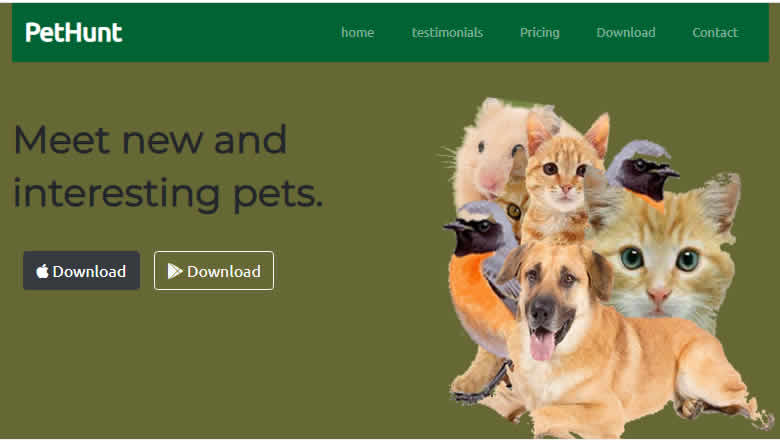](https://abdurahmanm2020.github.io/PetHunt/)  this is a pet shop full of pets
 
 4. [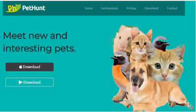](https://abdurahmanm2020.github.io/PetHunt-Pet-retailer/) this is a pet shop full of pets
 
 5. [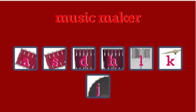](https://abdurahmanm2020.github.io/music-maker/) this ia a drum kit you use it to make a drum beat
 
 6. [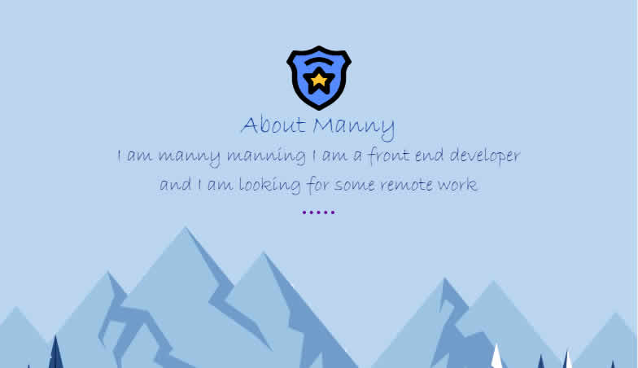](https://abdurahmanm2020.github.io/Manny/) this is a site all about me and the things I can do 
 
 7. [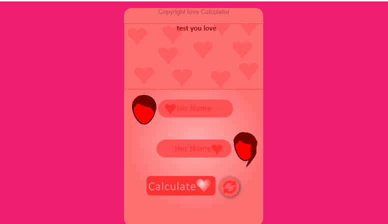](https://abdurahmanm2020.github.io/loving/) this is a love calculator that i made and it is very honest
 
 8. [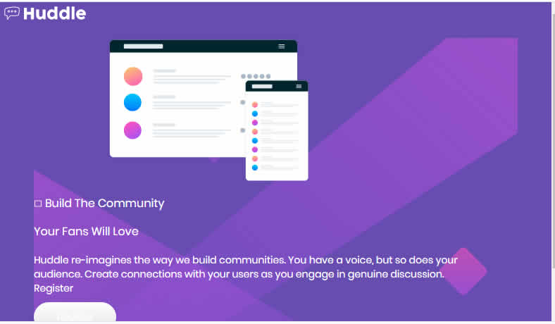](https://abdurahmanm2020.github.io/Huddle/) this is anothe one of the frontend mentor challanges
 
 9. [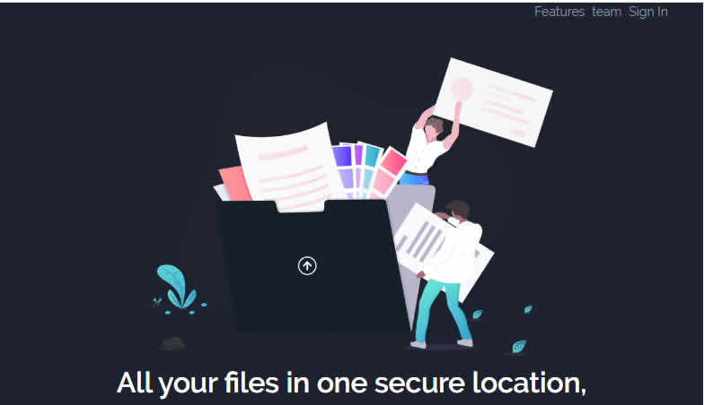](https://abdurahmanm2020.github.io/Fylo/) this is anothe one of my frontend mentor challanges that I coded
 
 10. [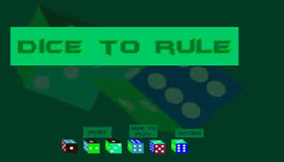](https://abdurahmanm2020.github.io/Dice-to-rule/start-page.html) thia is a doce game I made one of the graetes site ever
 
 11. [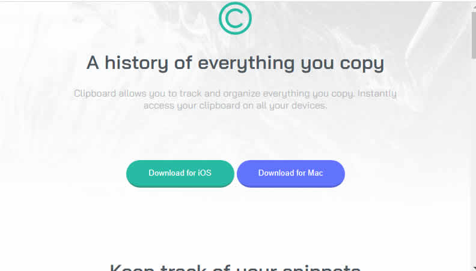(https://abdurahmanm2020.github.io/Clipboard/) this is one if the frontend mantor challanges 
 
 12. [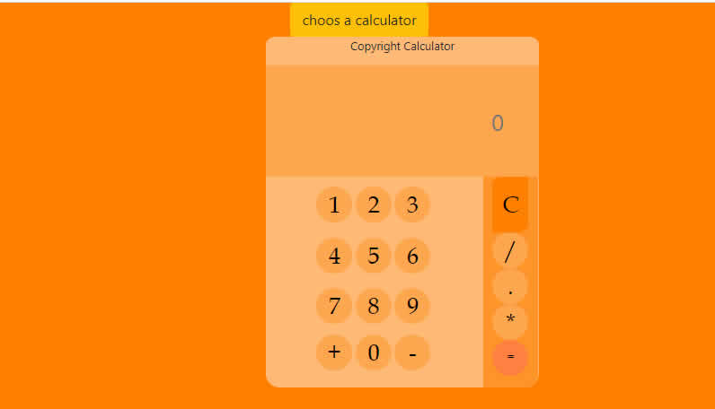](https://abdurahmanm2020.github.io/Calculator/calulator.html) THis is a calculator that I have de
 
[Link](url)

             | 
------------ | -------------

images profile/
For more details see(https://guides.github.com/features/mastering-markdown/).

### offers

i have been coding for a very long time and I now feel as if I am ready for some more chaliges SEE MORE OF MY WERK [my github](https://github.com/Abdurahmanm2020). if you have a job you whant to bo done give me the money and Il give you you site 

### Support or Contact

you can find me here? Check out[follow me on github](https://github.com/Abdurahmanm2020) and Il check in
